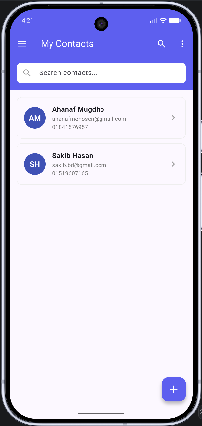
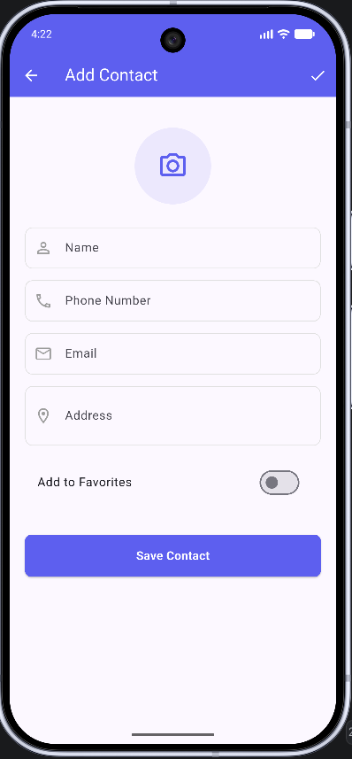
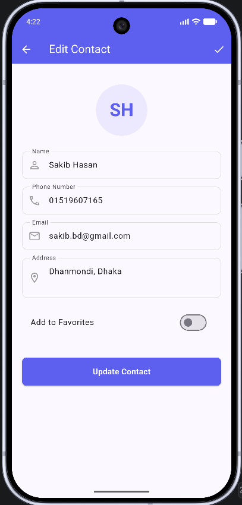
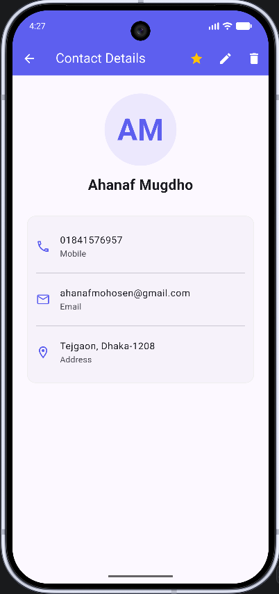
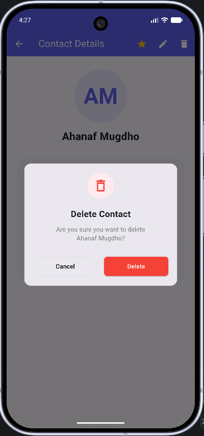
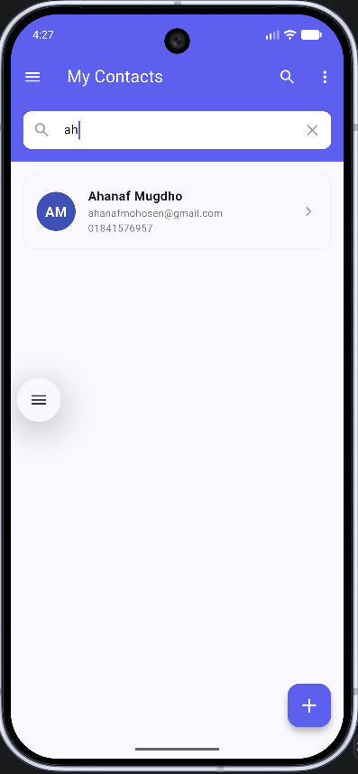
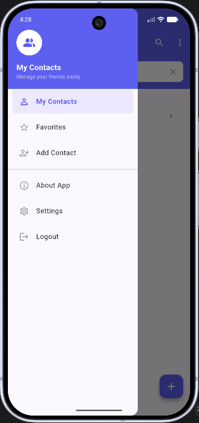
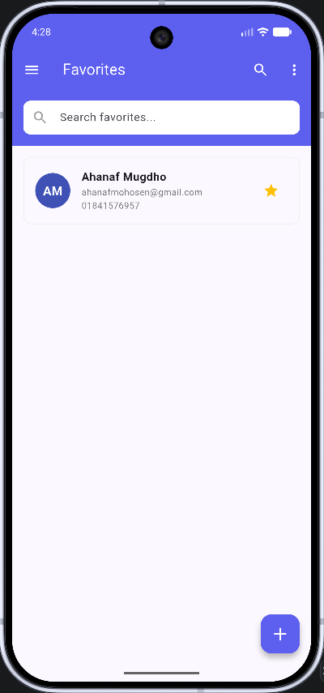
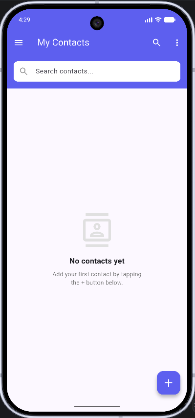
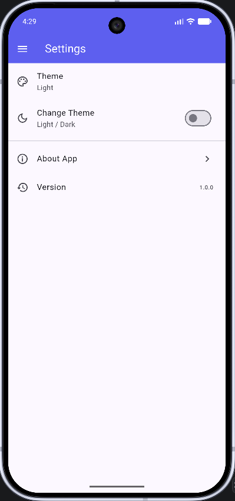

# Contact Management App

A comprehensive Flutter-based Contact Management system featuring local database persistence, searching, and a beautiful UI based on modern design principles.

## 📱 Features

- **Full CRUD Operations**: Create, Read, Update, and Delete contacts.
- **Local Persistence**: Powered by SQLite (`sqflite`) to keep your data safe on-device.
- **Search**: Fast real-time searching by Name, Phone, or Email.
- **Favorites**: Mark important contacts as favorites and view them in a dedicated screen.
- **Theming**: Supports both **Light** and **Dark** modes.
- **Modern UI**: Clean layout with circular initials, custom dialogs, and a smooth navigation drawer.

## 📸 Screenshots

| My Contacts | Add Contact | Edit Contact | Contact Details | Delete Dialog |
|:---:|:---:|:---:|:---:|:---:|
|  |  |  |  |  |

| Search | Side Menu | Favorites | Empty State | Settings |
|:---:|:---:|:---:|:---:|:---:|
|  |  |  |  |  |

## 🛠️ Built With

- **Flutter**: UI Toolkit for building natively compiled applications.
- **SQLite (sqflite)**: Local database for data storage.
- **Path**: For handling file paths across platforms.

## 🚀 Getting Started

1. **Clone the repository**:
   ```bash
   git clone https://github.com/your-username/contact_management_app.git
   ```

2. **Navigate to the project directory**:
   ```bash
   cd contact_management_app
   ```

3. **Install dependencies**:
   ```bash
   flutter pub get
   ```

4. **Run the app**:
   ```bash
   flutter run
   ```

## 📜 Project Structure

- `lib/models/`: Data models (Contact).
- `lib/database/`: Database helper for SQLite operations.
- `lib/screens/`: App screens (List, Details, Add/Edit, Favorites, Settings).
- `lib/widgets/`: Reusable UI components (ContactCard, CustomDrawer, etc.).
- `lib/main.dart`: App configuration and theme management.
